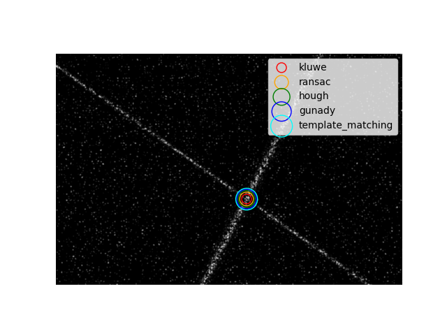

# Laser Cross Detection

## Overview and Core Utilities
This repository contains code to accurately detect the intersection point of two light beams in 2d images. The module can be used in combination with volumetric camera calibration based on the laser cross target method developed by [Hardege et al.](https://doi.org/10.1007/s00348-023-03729-1). An example of the problem is shown below:



The package provides a core module `laser_cross_detection.core` with five different methods to detect the point of intersection:

- RANSAC
- Probabilistic Hough Transform
- Template Matching (currently under construction)
- Kluwe (new implementation by the authors)
- Gunady (beam fitting method described by Gunady et al. 2024)

The example image can be generated by executing

```bash
python example.py
```
The corresponding output is

```bash
Created test image with intersection point at [659.79762583 502.90947781]
Testing Methods...

        kluwe - [659.8236829  502.95526115]
        ransac - [659.89846121 502.68817464]
        hough - [659.91429129 502.34140622]
        gunady - [660.07210569 503.1892573 ]
        template_matching - [660.29762583 503.40947781]

Done
```
which allows a comparison between the actual point of intersection and the detected one.

## Testing
The repository provides a testing module `laser_cross_detection.test` which can be used to create synthetic images, like the one shown above. Images can be created with or without noise. The beams can be freely positioned in the image using and angle $\theta$ and radius from the image center $\rho$. Using these parameter the point of intersection can be calculated mathematically and compared to the predictions of the detection methods.

The noise in the images is created by masking the beams by Perlin noise, adding Perlin noise, adding Salt and Paper noise and by adding Gaussian noise to the Gaussian Intensity Distribution of the beams.

## Calibration
To make use of the detections a calibration module `laser_cross_detection.calibration` exists. It supports linear calibration (Direct Linear Transform - DLT) and polynomial calibration using Soloff Polynomials ([Soloff et al. (1997)](https://doi.org/10.1088/0957-0233/8/12/008)). Both approaches support multi camera setups.